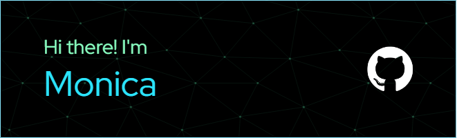

<h3 align="center">An enthusiast leaner and Statistics and Data Science student at USP - Brazil.</h3>

- 🌱 I’m currently learning **SQL and JavaScript**

- 📫 How to reach me **monovelli@usp.br**

<h3 align="left">Connect with me:</h3>

<h3 align="left">Languages and Tools:</h3>

         

